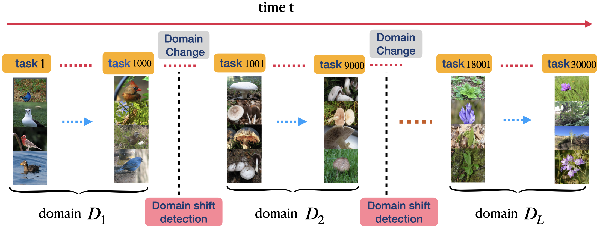

This repository contains the code accompanying the ICCV 2021 paper "Meta Learning on a Sequence of Imbalanced Domains with Difficulty Awareness" Paper [link](https://openaccess.thecvf.com/content/ICCV2021/papers/Wang_Meta_Learning_on_a_Sequence_of_Imbalanced_Domains_With_Difficulty_ICCV_2021_paper.pdf): 



#### Requirements to run the code:
---

1. Python 3.7
2. PyTorch 1.8.0
3. torchmeta 1.7.0
4. numpy 1.20.3
5. tqdm


#### Download dataset:
---

Download six datasets ( ['Quickdraw', 'MiniImagenet', 'Omniglot', 'CUB', 'Aircraft', 'Necessities']) from google drive [here](https://drive.google.com/file/d/1mn7V9PzYSesEEenvxRP7LDalooVtss63/view?usp=sharing)
and put the dataset folder in the root directory of this project

#### Experiments on one domain sequence:
---
Usage for the Proposed Method of Memory Management with Domain Distribution and Difficulty Awareness

```python
python train_meta.py
```

### Reference
---

```
@InProceedings{Wang_2021_ICCV,
    author    = {Wang, Zhenyi and Duan, Tiehang and Fang, Le and Suo, Qiuling and Gao, Mingchen},
    title     = {Meta Learning on a Sequence of Imbalanced Domains With Difficulty Awareness},
    booktitle = {Proceedings of the IEEE/CVF International Conference on Computer Vision (ICCV)},
    month     = {October},
    year      = {2021},
    pages     = {8947-8957}
}


